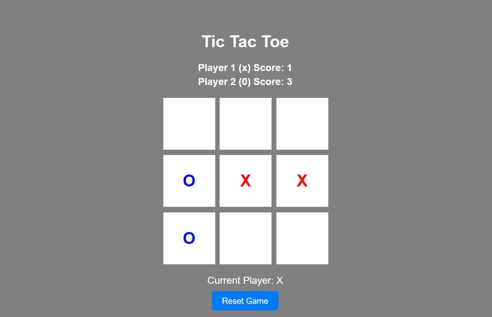
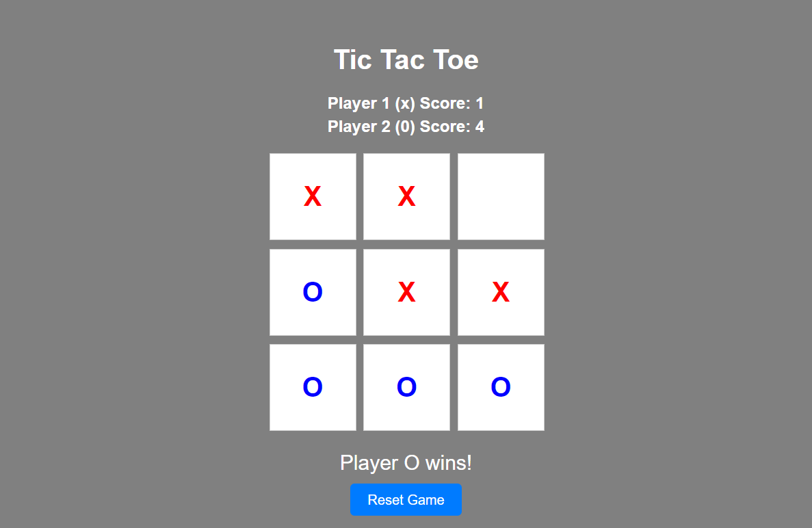
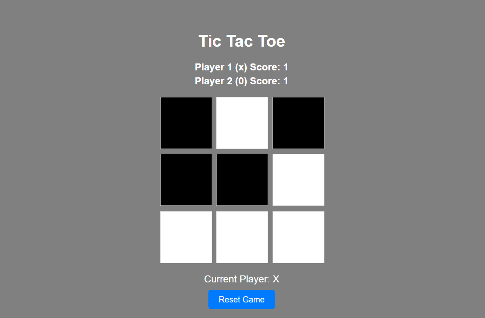
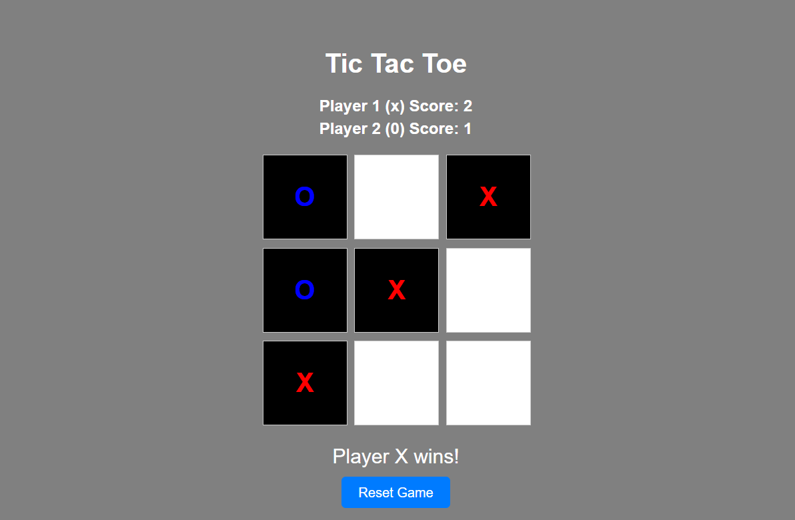

# Tic Tac Toe Flask Application

A simple Tic Tac Toe game built with Python and Flask. This application allows two players to play Tic Tac Toe in a web browser.
Originally forked from NM-Tafe Group Activity, and then Updated by Jeonghyun Min

## Features

- Two-player Tic Tac Toe game
- Branch > main: normal tic tae toe game
- Branch > blind: blind tic tae toe game in which players cannot see their marks until the game end
- Simple web interface
- Option to reset the game
<br><br>

## Game Examples
### 1-1. Normal Tic-tac-toe ( Playing )

<br>

### 1-2. Normal Tic-tac-toe ( Result )

<br>

### 2-1. Blind Tic-tac-toe ( Playing )

<br>

### 2-2. Blind Tic-tac-toe ( Result )

<br><br>


## Getting Started

### Prerequisites

- Python 3.x
- pip (Python package installer)

### Installation

1. **Clone the repository:**

   ```bash
   git clone https://github.com/yourusername/tic-tac-toe.git
   cd tic-tac-toe
   ```

2. **Install dependencies:**

   ```bash
   pip install -r requirements.txt
   ```

3. **(Optional) Change to blind branch**
   ```bash
   git checkout blind
   ```
   
4. **Run the application:**

   ```bash
   python app.py
   ```
   
5. **Open your web browser:**

   Go to `http://127.0.0.1:5000` to play the game.
